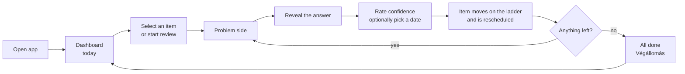
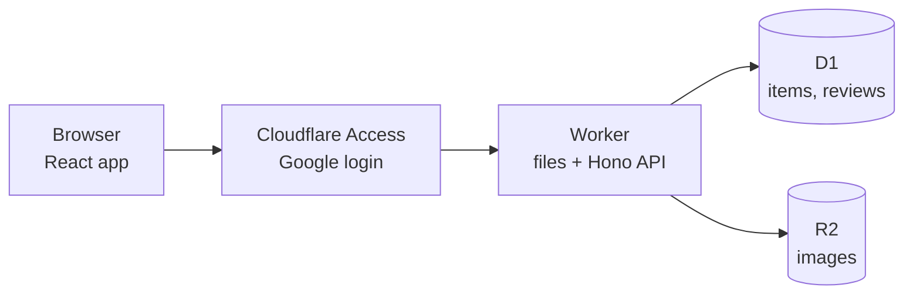

# Mnemos — Design Plan

## Overview

Mnemos is a sleek, fast study scheduler that uses simple spaced repetition on a ladder. You add study items, review the ones due each day, rate how confident you feel, and the item climbs or drops on your ladder of review gaps.

- **Who:** me plus a small group of friends and classmates, each with their own items and settings.
- **Two situations:** a laptop for adding, editing and longer review sessions; a phone for quick reviews, often one-handed on a tram, and for editing when needed.
- **Fast:** no cold starts, no spinners, and screens change instantly.
- **Keyboard-first on desktop, thumb-first on the phone:** every main action has a shortcut on desktop and a big button within thumb reach on the phone.
- **Predictable:** a fixed ladder of review gaps with no complex algorithm. Every confidence button shows the date and stop it leads to.
- **Budapest-themed:** strong where you rest, quiet where you work.
- **Free to run:** everything fits in free plans.

## Core concepts

The app has four things: sections that group items, items you study, reviews that record each study session, and a ladder that turns confidence into days.

- **Section:** a named group of items, such as a subject or problem set, drawn as a metro line. Each section has:
  - a short code: 2–3 characters (A–Z, 0–9), unique per person. The app suggests one from the name, but you can always type your own instead, when creating the section or later. The suggestion:
    - strips accents (Gráfok → GRA);
    - for two or more words, takes the initials of the first three (Data structures → DS, Operating systems 2 → OS2);
    - for one word, takes its first three letters (Compilers → COM), with no camelCase splitting (TypeScript → TYP);
    - if that code is taken, swaps the last character for 2–9 (COM → CO2, DS → DS2);
    - gives a one-letter name a digit (C → C2), and gives no suggestion when the name has no usable letters;
  - a line colour, assigned once when the section is created, cycling M2 red → M3 blue → M4 green.

  Reordering or deleting sections never changes a colour. The code, not the colour, identifies a section.
- **Item:** one thing to study (fields below). It sits on one stop of the ladder.
- **Review:** one record per time you review an item. It stores the date, your confidence, the stop before and after, the due date the item had, the next due date, and whether you picked that date yourself.
- **Ladder:** up to 7 stops, each with a gap in days (1–365, each longer than the one before). The default is 1, 2, 3, 5, 7, 14 and 28 days. The last stop is the Végállomás ("end of the line").
- **Confidence levels:**
  - **Confident:** the item moves up one stop (on the last stop, it stays there).
  - **Neutral:** the item keeps its stop.
  - **Not at all:** the item goes back to stop 1.

| Item field | Required | Notes |
| --- | --- | --- |
| Name | Yes | Shown in lists and on the dashboard. In review it is hidden until the answer is shown, because it can give the answer away. Exception: if the problem description is empty, the name is the question. Inline formatting only |
| Section | Yes | One section per item |
| Description | No | Short context, shown above the problem. Inline formatting only |
| Problem URL | No | Link to the original problem. Opens in a new tab and never reveals the answer |
| Problem description | No | Text of the problem, in Markdown |
| Problem images | No | Several allowed, in order |
| Answer URL | No | Link to a solution |
| Answer text | No | Your written answer, in Markdown |
| Answer images | No | Several allowed, in order |
| Side note | No | Tips or reminders for next time, in Markdown. Shown last, just above the confidence buttons |
| Stop | Set by the app | Where the item is on the ladder. New items start on stop 1 |

An item's review history comes from its reviews; the item itself doesn't keep a list of dates.

**Text formatting:**

- **Markdown fields:** Problem description, Answer text and Side note use GitHub-style Markdown, including code blocks.
- **Inline-only fields:** Name and Description allow only inline code, bold and italic.
- **Not allowed:**
  - raw HTML;
  - images inside Markdown (images go in the image fields);
  - math formulas, for now.

## App flow and screens

The app opens on today's dashboard. Reviewing is a short loop: read the problem, reveal the answer, rate, move on.

Opening one item from the dashboard returns there after rating. Flash review runs the loop over a whole set, and when nothing is left for today, the All done screen appears.

| Screen | Purpose | Shows |
| --- | --- | --- |
| Dashboard | See one day at a glance | **Week strip:** reviews done on past days, items left today, items due on future days. **Summary line:** left · late · done. **Sections:** each drawn as a metro line, listing its items with their stop and overdue delay. **Start review** button. **On a future day:** that day's items, with the ones already reviewed today dimmed and listed last in their section, and a Review early button |
| Review mode | Study one item | **Problem side:** description, problem, images and link. **Reveal:** tap or click anywhere, or press Space; images open zoom and links open normally instead. **Answer side:** the name as a heading, then answer text, images, link and side note; the problem shrinks to a card with thumbnails. **Rating:** three confidence buttons, each showing the date and stop it leads to, plus Pick a date. **Undo:** available for 4 s after rating |
| Flash review | Review a set in one run | All items due today, or all of one section's. Goes section by section in your section order; within a section, the latest items come first (most days late first), then the ones due today, with equally late items in creation order, oldest first. Starts with "Kérjük, vigyázzanak, az ajtók záródnak!" |
| All done | The rest moment when nothing is left today | Végállomás over the Parliament illustration, today's count, tomorrow's due count, and a neutral Review early button |
| Items | Find and manage items | Search (names, descriptions and notes), filter by section, and sort by next due. A table on desktop, two-line rows on the phone |
| Item editor | Add or edit an item | **Fields:** every item field. **Images:** paste or drop on desktop, camera or photo library on the phone; reorder and remove. **Section picker:** can create a new section on the spot. **Markdown fields:** a Write / Preview toggle. **Save:** stays within reach |
| Item history | See how an item has gone | A line map (reviews left to right, stops bottom to top, dot size = confidence, marks for picked dates and early reviews), plus the same data as a table. On the phone, the line map shows the latest 10 reviews; scroll back for older ones. The table always lists them all |
| Settings ("Menetrend") | Tune the ladder; manage the account | The ladder drawn as a metro line: each stop's gap and item count, add / edit / remove stops, and a preview of where each rating leads. Account and sign out |

## Scheduling rules

Next due date = review date + the gap of the stop the item lands on, unless you pick a date yourself.

- **Ladder moves:** Confident moves up one stop (staying on the last), Neutral stays, Not at all goes back to stop 1.
- **Manual date:** picking a date replaces only the date. You still rate your confidence, the ladder still moves, and the review records that the date was manual. Only dates after today can be picked; the calendar disables today and the past.
- **New items:** start on stop 1 and are due the day they're added.
- **Overdue:** an item whose due date has passed stays on today's dashboard, marked with how many days late it is ("+3 days" = today minus the due date).
- **Order:** sections follow your section order. Within a section, the latest items come first (most days late first), then the ones due today. Items that are equally late, including all items due today and all of a future day's items, go in creation order, oldest first. On a future day, the items already reviewed today come last in their section. The dashboard and flash review use the same order.
- **Late and early reviews:** the next date always counts from the day you actually review. You can review a future day's items early; an early review works like any other and counts toward today's done.
- **Once a day:** an item can be reviewed at most once per day. After that it shows dimmed as "Reviewed today" on future days and can't be reviewed again until tomorrow. Undo covers a wrong rating.
- **Undo:** puts back the stop and due date the item had before the rating, and deletes the review, so the item can be rated again. Only a review made today can be undone.
- **Other days:** a future day shows the items due then. A past day shows only the reviews you did that day; missed items don't appear there.
- **Ladder edits:** apply from each item's next review; due dates already set stay as they are.
  - **Adding a stop:** adds a new last stop. Its gap starts at double the previous last gap, capped at 365 days, and can be edited. No stop can be added once the ladder has 7 stops or its last gap is already 365 days.
  - **Removing a stop:** its items move down one stop (stop 1's items stay on the new stop 1), and the stops after it renumber.
  - **Minimum:** a ladder always keeps at least one stop.

**Counts** have one definition everywhere:

| Count | Definition |
| --- | --- |
| Left | Items due today or earlier that you haven't reviewed today |
| Late | The part of Left that was due before today (never added on top) |
| Done | Reviews made today, early ones included |
| Due | Items scheduled for a future day, including ones already reviewed today |
| Early | A future day's Due minus the items already reviewed today (the Review early count) |
| Line | Left, for one section |

**Note on "today":** today is the user's local calendar date, not the server's. Workers run in UTC, so at 00:30 in Budapest the server still sees yesterday. Store due dates as plain dates (`2026-09-24`), have the browser send its local date with each request, and never let the server work out "today" itself.

## Visual design

Direction B, "Danube at dusk". The design draft ("Mnemos visual directions", round 3) and its `tokens.css` are the source of truth. This section summarizes them.

- **Dark mode only for now:** the tokens use shadcn/ui's semantic names, so a light theme later is one more block of values.
- **Budapest, strong where you rest, quiet where you work:**
  - **Review mode:** almost no theming.
  - **Dashboard and history:** use the metro-line structure.
  - **Rest moments:** go full Budapest. These are All done, the flash review start, the Settings header and the app icon.

  Every Hungarian phrase has its English translation directly under it.
- **One colour, one meaning:**
  - **Tram yellow #F5C400** is the only accent. It means selected, focused or primary action.
    A key hint inside a yellow button uses a darker yellow fill (#D0A806, `kbd-primary`) with Dusk text.
  - **Section lines** use M2 red, M3 blue and M4 green.
  - **No colour** for confidence, overdue, success or errors. They use words, icons, weight and size.
  - **Lamplight gold (#E3A857)** appears only inside illustrations.
- **Shapes:** circles are items and reviews on a section's line; squares are ladder stops.
- **Type:** Atkinson Hyperlegible Next for text; Atkinson Hyperlegible Mono for code, dates, counts and keys. Nothing under 12 px.
- **Motion:** 150 ms at most, no spinners or skeletons, and no motion at all with reduced motion.
- **Phone:** thumb-first. Buttons are at least 48 px tall (confidence buttons 56 px) and sit at the bottom. Key hints are hidden on touch screens.
- **Layout by width:**

  | Width | Layout |
  | --- | --- |
  | Under 640 px (phones) | Tab bar at the bottom, one column, floating Start review, confidence buttons stacked, pickers and confirmations in bottom sheets |
  | 640–1023 px (large phones sideways, tablets upright, narrow windows) | The same tab-bar layout, with content centred at up to 760 px and the three confidence buttons side by side |
  | 1024–1279 px (tablets sideways, small laptops) | The 248 px sidebar replaces the tab bar; one column of section cards; pickers and confirmations as popovers and dialogs |
  | 1280 px and up (laptops, desktops) | Sidebar plus two columns of section cards on the dashboard |

  The sidebar starts at 1024 px so a phone turned sideways never gets it. Key hints follow the input, not the width: they show wherever there is a mouse or trackpad and hide on touch screens.
- **Contrast:** every text and background pair meets WCAG AA; the draft lists the ratios.
- **Art:**
  - **Parliament (All done):** a detailed, lamplit illustration.
    - Size: 3:2, 2400 × 1600, WebP or AVIF under about 400 kB, plus a 1200 × 800 copy for phones.
    - Faded into the page with a CSS mask.
    - Loaded in advance while you review the last item.
  - **Zsolnay tile pattern:** stays tone-on-tone.

  Both ship as static files, not in R2.

## Keyboard shortcuts

The whole review loop works without the mouse, and `?` shows the list in the app. Key hints appear on desktop and are hidden on touch screens. Macs show ⌘ instead of Ctrl.

| Key | Where | Action |
| --- | --- | --- |
| F | Dashboard | Start review (Review early on a future day or on All done) |
| Shift+F | Dashboard | Review the selected section |
| J / K | Dashboard, Items | Move between items |
| Enter | Dashboard | Open the selected item in review mode |
| [ / ] | Dashboard | Previous or next day |
| / | Dashboard, Items | Search |
| Space | Review | Show or hide the answer |
| 1 / 2 / 3 | Review | Confident / Neutral / Not at all |
| D | Review | Pick the next date yourself |
| Z | Review | Zoom the first image |
| E | Dashboard, review | Edit the item |
| H | Dashboard, review, Items | Item history |
| U | Review | Undo the last rating |
| Enter | Items | Edit the selected item |
| Ctrl+Enter | Item editor | Save |
| ← / → | Settings | Move between stops |
| Enter | Settings | Edit the gap |
| Del | Settings | Remove the stop |
| A | Settings | Add a stop |
| T / I / , | Anywhere | Today / Items / Settings |
| N | Anywhere | New item |
| Ctrl+K | Anywhere | Command menu |
| Esc | Anywhere | Close or cancel |
| ? | Anywhere | Show all shortcuts |

## Tech stack

Everything runs on one free Cloudflare account as a single Worker, so there are no cold starts and nothing pauses when the app sits unused.

| Layer | Choice | Why |
| --- | --- | --- |
| Hosting + API | Cloudflare Workers, with the frontend and a Hono API in one Worker | Starts in milliseconds; frontend files are served free and unlimited |
| Database | Cloudflare D1 (SQLite) + Drizzle ORM | Relational data fits naturally; never pauses |
| Images | Cloudflare R2, or Workers KV to avoid adding a card | Built for files, with no bandwidth fees; stays behind the login |
| Login | Cloudflare Access + Google login, 1-month session | No login code to write; strangers can't load the app |
| Frontend | Vite + React + TypeScript, Tailwind CSS v4, shadcn/ui (Radix primitives, Nova preset, restyled by the tokens), Motion, dnd-kit | Polished look, smooth transitions, keyboard-friendly; dnd-kit reorders images |
| Text | react-markdown + remark-gfm; rehype-highlight loaded only when an item has a code block | Safe by default (no raw HTML) and light |
| Fonts | @fontsource-variable/atkinson-hyperlegible-next and -mono, self-hosted | No third-party requests; the latin-ext subset loads only when a page needs it |
| Mobile | Responsive layout, designed for the phone as much as the desktop; PWA via vite-plugin-pwa (optional) | Reviews on the go; installs to a phone's home screen |

**Cost:** $0. R2 requires a card on file, and use beyond its free amounts is billed, not blocked.

Sources: [Workers pricing](https://developers.cloudflare.com/workers/platform/pricing/), [D1 pricing](https://developers.cloudflare.com/d1/platform/pricing/), [R2 pricing](https://developers.cloudflare.com/r2/pricing/), [R2 card requirement](https://community.cloudflare.com/t/why-using-r2-free-tier-involves-giving-card-info/945179), [Zero Trust plans](https://www.cloudflare.com/plans/zero-trust-services/)

## Architecture

Every request passes Cloudflare Access first, and the Worker stays thin: it checks who you are, runs SQL, and returns data.

The browser loads the app from the Worker, then talks to its API for data and images.

- **Identity:** a middleware checks the `Cf-Access-Jwt-Assertion` header with the `jose` library, using the team domain and the app's AUD tag. It maps the email to a user, and every query is scoped to that user.
- **Browser does the heavy work:** image resizing, Markdown rendering and date handling happen in the browser, not the Worker.
- **Worker does small work:** loading a day, saving a review, and editing an item each take a few milliseconds of CPU.

Source: [Validate Access JWTs](https://developers.cloudflare.com/cloudflare-one/access-controls/applications/http-apps/authorization-cookie/validating-json/)

## Data model

Six D1 tables, and each screen is one indexed query by date.

| Table | Key columns | Notes |
| --- | --- | --- |
| users | id, email, created_at | Created on first login from the Access email |
| settings | user_id, ladder_days, next_line | ladder_days is a JSON list of gaps, default [1, 2, 3, 5, 7, 14, 28]. next_line is the colour counter (M2 → M3 → M4) for the next new section; it only moves forward |
| sections | id, user_id, name, code, line, position | line is m2, m3 or m4, set once at creation; code is unique per user; order is set by position |
| items | id, user_id, section_id, name, description, problem_url, problem_text, answer_url, answer_text, side_note, stop, due_on, created_at, updated_at | stop is the item's place on the ladder, starting at 1. due_on is a plain date. Index on (user_id, due_on) |
| item_images | id, item_id, side, image_key, position | side is problem or answer; image_key points to the stored image; position keeps the order |
| reviews | id, user_id, item_id, reviewed_on, confidence, stop_before, stop_after, was_due_on, next_due_on, manual, reviewed_at | Unique on (item_id, reviewed_on): one review per item per day. stop_before and was_due_on let Undo restore the item and give the early and late marks. Index on (user_id, reviewed_on) |

**Queries:**

- **Today's items:** every item with `due_on` on or before today, with overdue ones flagged. Items reviewed today have already moved to a later date, so they drop out on their own.
- **A future day's items:** items where `due_on` is that date. Those with a review dated today (found through the `(user_id, reviewed_on)` index) show dimmed and come last in their section.
- **A past day's history:** reviews where `reviewed_on` is that date.
- **An item's history:** reviews by `item_id`, newest first.
- **Removing stop k:** one update sets `stop = stop − 1` where `stop ≥ max(k, 2)`, and the gap is removed from `ladder_days`.
- **Undo:** delete the review and put `stop_before` and `was_due_on` back on the item.

## Images

Images are resized in the browser, stored in R2 under a name made from their content, and served through the Worker so they stay behind the login.

1. **Add:** paste, drop or pick an image in the item editor on desktop; use the camera or photo library on the phone.
2. **Shrink:** the browser resizes it to at most about 1,600 px, compresses it to WebP or JPEG, and names it by its SHA-256 hash, so the same image is never stored twice.
3. **Upload:** `PUT /api/images/<hash>.webp`. The Worker streams the file straight into R2, which uses almost no CPU.
4. **Save:** the item stores only the image name and its position in `item_images`. Images can be reordered and removed in the editor.
5. **Show:** `GET /img/<hash>.webp` streams the file back with `Cache-Control: private, max-age=31536000, immutable`, so the browser downloads each image only once.

Images live only in the image fields; Markdown images are not allowed. The Parliament illustration and the Zsolnay pattern are part of the app's static files, not user images.

**Guardrails:**

- Reject files over 2 MB and cap the number of images per user.
- Set a $1 budget alert. It sends an email but doesn't stop use.
- Keep storage behind one small module, so switching between KV and R2 touches nothing else.

Sources: [R2 Workers API](https://developers.cloudflare.com/r2/api/workers/workers-api-reference/), [KV limits](https://developers.cloudflare.com/kv/platform/limits/), [Budget alerts](https://developers.cloudflare.com/billing/manage/budget-alerts/)

## Login

Cloudflare Access with Google login: each person signs in about once a month per device, and the app itself contains no login code.

**One-time setup (about 15 minutes; the full checklist is in `docs/setup.md`):**

1. **Google Cloud Console:** create a project and a "Web application" OAuth client. Set the redirect URI to `https://<team>.cloudflareaccess.com/cdn-cgi/access/callback`.
2. **Cloudflare Zero Trust:** go to Integrations → Identity providers → Add Google, and paste in the client ID and secret.
3. **The Worker:** open its Access tab, choose Protect this Worker → All traffic, and pick the email-list policy. Never use the "Email domain" option with gmail.com: it would let every Gmail user in.
4. **The Access application:** allow your group's Google emails, use Google as the login method, and set both the app and global session to 1 month.

**Things to handle in code:**

- **No sign-in screen in the app:** Access shows its own login page before the app loads. The design draft's sign-in screen can only carry over as Access's login-page customization (name, logo, colours).
- **Sign out:** the Account card's Sign out links to `/cdn-cgi/access/logout`.
- **Session expiry:** after a month, API calls get redirected to the login page. Call `fetch` with `redirect: "manual"`, and if `res.type === "opaqueredirect"`, reload the page.
- **Phone install:** the manifest link needs `crossorigin="use-credentials"`, or installing fails behind Access.
- **Identity:** the Worker checks `Cf-Access-Jwt-Assertion` itself with `jose` (team keys, issuer, AUD tag). Cloudflare's `ctx.access` (August 2026) can't replace this: the router in front of a Worker with static assets doesn't pass it on.
- **Local development:** Access doesn't sit in front of `npm run dev`, so the Worker uses `DEV_USER_EMAIL` from `.dev.vars`, and only on localhost.

Sources: [Google identity provider](https://developers.cloudflare.com/cloudflare-one/integrations/identity-providers/google/), [Session management](https://developers.cloudflare.com/cloudflare-one/identity/users/session-management/), [Access for Workers](https://developers.cloudflare.com/workers/configuration/cloudflare-access/), [PWA behind Access](https://github.com/danny-avila/LibreChat/discussions/5154)

## Free-tier limits

A small group stays far inside every free limit. The estimates below assume a small group of regular users.

| Resource | Free limit | Estimated use |
| --- | --- | --- |
| Worker API requests | 100,000 per day | A few thousand per day |
| Worker CPU | 10 ms per request | A few ms per request |
| D1 row reads | 5 million per day | Small with indexed date queries |
| D1 row writes | 100,000 per day | About 1,000 on a heavy day |
| D1 storage | 500 MB per database, 5 GB total | Text and review history only |
| D1 queries | 50 per request | A handful per request |
| R2 storage | 10 GB per month | About 50,000 images at 200 KB each |
| R2 operations | 1 million uploads, 10 million reads per month | Reads stay low thanks to browser caching |
| Access users | 50 | The whole group |

**Rules to stay inside the limits:**

- Look up items and reviews by date through the indexes. Never scan the whole review log.
- Keep heavy work in the browser.
- If something ever doesn't fit, the Workers Paid plan costs $5 per month and raises these limits.

D1 daily limits are hard stops that reset at 00:00 UTC. The CPU limit is soft: an occasional overrun is tolerated, but repeated ones fail with Error 1102.

Sources: [Workers limits](https://developers.cloudflare.com/workers/platform/limits/), [D1 limits](https://developers.cloudflare.com/d1/platform/limits/), [D1 free-tier enforcement](https://shattered.io/cloudflare-d1-free-tier-caps-workers-64mib-2026/)

## Open points

Small decisions left for implementation:

- **Undo on the phone:** place the pop-up at the top, so it never covers Show answer on the next item.
- **Remove stop:** the confirmation should not remove on a plain Enter.
- **Math formulas (later):** remark-math + rehype-katex, loaded only for items that use them.
